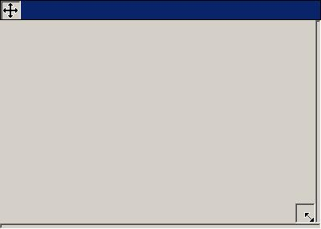



## A\*Easiest way to move form without titlebar and Resize borderless form\!

### Description

This has got to be the easiest way to resize a borderless form (borderstyle=0) and move a form without a titlebar!!! NO API!!! Please comment/vote.
 
### More Info
 

             |
---                |---
**Submitted On**   |2001-12-19 22:03:58
**By**             |[Ryan Olson \- OLSONAMI](https://github.com/Planet-Source-Code/PSCIndex/blob/master/ByAuthor/ryan-olson-olsonami.md)
**Level**          |Beginner
**User Rating**    |4.3 (39 globes from 9 users)
**Compatibility**  |VB 5\.0, VB 6\.0
**Category**       |[Miscellaneous](https://github.com/Planet-Source-Code/PSCIndex/blob/master/ByCategory/miscellaneous__1-1.md)
**World**          |[Visual Basic](https://github.com/Planet-Source-Code/PSCIndex/blob/master/ByWorld/visual-basic.md)
**Archive File**   |[A\_Easiest\_4313112192001\.zip](https://github.com/Planet-Source-Code/ryan-olson-olsonami-a-easiest-way-to-move-form-without-titlebar-and-resize-borderless-form__1-29970/archive/master.zip)

